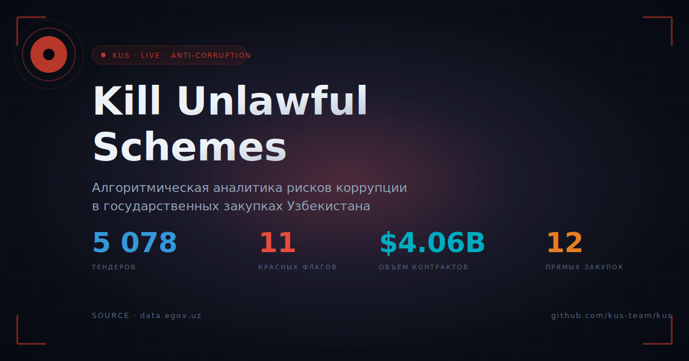

<div align="center">

# 🛡️ KUS — Kill Unlawful Schemes

**Алгоритмическая аналитика рисков коррупции в государственных закупках Узбекистана**

[](https://www.python.org/)
[](https://fastapi.tiangolo.com/)
[](https://www.postgresql.org/)
[](https://www.anthropic.com/)
[](https://data.egov.uz/)

`5 078 тендеров · 15 датасетов · $4.06 млрд · 11 красных флагов · 137 категорий`



</div>

---

## Проблема

В Узбекистане **отсутствие данных о госзакупках — не проблема**: они открыты на [data.egov.uz](https://data.egov.uz). **Проблема — никто их не анализирует системно.**

Журналисты, активисты и сами чиновники работают руками: смотрят отдельные тендеры, не видят паттернов. Откаты, «свои компании» и завышение цен расцветают потому, что для их обнаружения нужно сравнить **тысячи** контрактов одновременно.

## Что делает KUS

KUS превращает разрозненные открытые данные в **понятный сигнал риска для каждого тендера**.

| Этап | Что |
|---|---|
| 🔌 **Source** | Реверснули внутреннее API портала data.egov.uz — нашли 157 датасетов сырых тендеров. |
| 📥 **Ingest** | Загрузили 15 крупнейших (Минэкономфин, Минюст, Минздрав, Минтранс, Минстрой, Хокимияты, Алмалыкский ГМК и др.) — 5 078 контрактов. |
| 🧹 **Normalize** | Свели плавающие схемы (опечатки, разные единицы суммы, Excel-даты) в единую модель `tenders`. |
| 🚩 **Risk score** | Каждому тендеру присваивается индекс риска **0–100** по трём красным флагам. |
| 📊 **Visualize** | 6 интерфейсов: дашборд, таблица, граф связей, карта Узбекистана, профиль компании, проверка одного тендера. |
| 🤖 **AI** | Claude Sonnet 4.6 объясняет каждый риск-флаг **простым русским языком** для гражданина. |

## Алгоритм риска

Три красных флага, каждый — независимый сигнал:

| Флаг | Баллы | Условие | Что значит |
|---|---|---|---|
| 🤝 **Монополизация** | **+30** | Один поставщик (ИНН) выиграл у одного заказчика (ИНН) **более 5 раз** | «Своя компания» |
| 💸 **Завышенная цена** | **+40** | Сумма контракта **на 30%+ выше средней** по `Kategoriyasi` | Откат / переплата |
| 🚫 **Без конкурса** | **+30** | Поле `Togridantogrixaridamalgaoshirishasosi` содержит «Прямые договора / To'g'ridan» | Договорная закупка |

**Зоны риска:** 🟢 0–29 норм · 🟡 30–69 подозрительно · 🔴 70–100 высокий риск.

## Стек

| Слой | Технологии |
|---|---|
| **Backend** | Python 3.13 · FastAPI · psycopg 3 · Pydantic-Settings |
| **Database** | PostgreSQL 17 (JSONB, pg_trgm, btree_gin) · SQLite-fallback для local dev |
| **Frontend** | Server-rendered Jinja2 + vanilla JS (без React) · Chart.js · vis-network · Leaflet |
| **AI** | Anthropic Claude Sonnet 4.6 — нарратив объяснения для гражданина |
| **Theme** | Dark «control room» с frosted-glass панелями поверх карты Узбекистана как фона |

## Страницы

```
/                  Дашборд: KPI + анимированные счётчики, donut рисков,
                   bar категорий, live-feed красных, trends-chart,
                   heatmap (категория × месяц), топ компаний
/tenders           Таблица/карточки всех тендеров, фильтры по риску,
                   pill-фильтры, Export CSV, bookmark на каждой карточке
/companies         Сетка карточек победителей с поиском и сортировкой
/companies/{ИНН}   Профиль компании: hero + 5 KPI + timeline побед +
                   мини-граф связей с заказчиками + контракты
/graph             Vis.js граф «заказчик ↔ победитель» с HUD-стилем
/map               Leaflet карта Узбекистана: районы Сурхандарьи +
                   штабы заказчиков, frosted-glass панели поверх
/compare           Side-by-side сравнение двух тендеров с подсветкой различий
/check             Проверить любой тендер: риск-кольцо SVG, 3 флага,
                   price-comparison bar, AI-нарратив, share, bookmark
/complaint/{id}    Сгенерировать жалобу на тендер для антикор. агентства
                   (mailto + copy-to-clipboard, авто-факты из БД)
```

## Фичи UI

- 🎨 **Тёмная / светлая тема** (toggle в navbar или Ctrl+Shift+L)
- 🗺️ **Карта Узбекистана как фон** на всех страницах (Leaflet decoration + параллакс)
- 🔖 **Bookmarks** — отметить интересные тендеры (хранятся в localStorage)
- 📤 **Share** — Telegram / WhatsApp / Email / Copy-link на странице тендера
- 📊 **Skeleton-loaders, tooltips, page transitions**
- 📱 **Mobile-friendly** — hamburger-menu, 1-column layouts
- 🎯 **Open Graph preview** — красивый превью в Telegram/WhatsApp/Slack

## Запуск локально

### Минимум (SQLite, без облака):

```bash
git clone https://github.com/kus-team/kus.git && cd kus
pip install -r backend/requirements.txt

# 1. Загрузить тендеры с egov.uz → SQLite
python -m backend.ingest.loader

# 2. Посчитать risk_score
python -m backend.ingest.risk

# 3. Запустить веб-сервер
uvicorn backend.app.main:app --reload
# → http://localhost:8000
```

### Production (Postgres + Claude API):

```bash
# 1. Создать .env
cp backend/.env.example backend/.env
# DATABASE_URL=postgresql://...
# ANTHROPIC_API_KEY=sk-ant-...   (опционально, для AI-narrative)

# 2. Применить схему и загрузить данные
python -m backend.db.connection
python -m backend.ingest.loader && python -m backend.ingest.risk
uvicorn backend.app.main:app --host 0.0.0.0 --port 8000
```

Подробная инструкция деплоя: [`DEPLOY.md`](DEPLOY.md).

## Структура

```
backend/
├── app/                FastAPI: 7 страниц + 12 API endpoints
│   ├── main.py
│   ├── templates/      Jinja2 (dashboard, tenders, companies, company_profile, check, graph, map)
│   └── static/css/     Темная control-room тема
├── services/
│   ├── narrative.py    Claude Sonnet 4.6 → объяснение тендера простым языком
│   └── graph.py        SQL-агрегация → vis.js nodes/edges
├── ingest/
│   ├── normalizer.py   Маппинг разных схем (опечатки, единицы, даты) → unified
│   ├── loader.py       fetch egov.uz → normalize → UPSERT
│   └── risk.py         Pure-Python расчёт risk_score (3 флага → 0–100)
└── db/
    ├── schema.sql          Postgres (JSONB, pg_trgm, triggers)
    └── schema_sqlite.sql   SQLite fallback
```

## Public API

REST-документация (Swagger UI): **`/docs`** · OpenAPI JSON: **`/openapi.json`**

Основные эндпоинты:

```
GET   /api/health                              health-check + кол-во тендеров
GET   /api/tenders?q=&min_risk=&order=         поиск/листинг с фильтрами
GET   /api/tenders/{id}                        один тендер с risk_flags
GET   /api/tenders/{id}/similar                похожие по названию (pg_trgm)
POST  /api/tenders/{id}/explain                AI-нарратив через Claude
GET   /api/tenders/suspicious                  топ красных
GET   /api/compare?a=X&b=Y                     side-by-side двух тендеров
GET   /api/cases                               топ-кейсов «заказчик ↔ победитель»
GET   /api/company/{tin}                       профиль компании
GET   /api/graph/network?min_wins=             граф связей для vis.js
GET   /api/analytics/stats                     KPI дашборда
GET   /api/analytics/trends                    помесячная динамика
GET   /api/analytics/heatmap                   категория × месяц
GET   /api/analytics/by-category               распределение
GET   /api/analytics/by-region                 регионы Узбекистана
GET   /api/analytics/ministries                рейтинг госорганов
GET   /api/analytics/top-risky-companies       топ компаний
GET   /api/analytics/tender-of-week            самый красный за неделю
GET   /api/live/xarid                          live-feed UZEX (5-мин кэш)
GET   /api/export/tenders.csv?min_risk=        CSV экспорт
```

Все ответы — JSON. CORS открыт. Rate-limit мягкий. Для AI-narrative нужен `ANTHROPIC_API_KEY`.

## Auto-обновление (GitHub Actions)

`/.github/workflows/daily-ingest.yml` — раз в сутки (03:00 UTC = 08:00 Tashkent):
1. Применяет миграции (`schema.sql`).
2. Тянет свежие данные с egov.uz через loader.
3. Пересчитывает `risk_score` для всех тендеров.
4. Health-check продакшен URL.

Для активации:
- В Settings репо → **Secrets and variables → Actions** добавить:
  - `DATABASE_URL` (secret) — production Postgres URL
  - `PROD_URL` (variable) — публичный URL приложения, опционально

## Что планируется

- [ ] Расширить ингест до всех 157 найденных датасетов (~50–100 тыс. контрактов)
- [ ] Справочник ИНН → название юрлица (сейчас часто только ИНН)
- [ ] Cron на ежедневное обновление с egov.uz
- [ ] AI-чат на боковой панели — «найди подозрительные тендеры в строительстве»
- [ ] Деплой публичной версии (Railway / Render / Fly.io)

## Команда

Проект для **республиканского хакатона по борьбе с коррупцией** (Узбекистан, апрель–май 2026).
Команда: 2 человека · 10 дней спринта.

## Лицензия

Open source. Жми ⭐, если идея нравится. Контрибьюция приветствуется.

---

> «Данные открыты. Анализ — вот в чём вопрос.»
